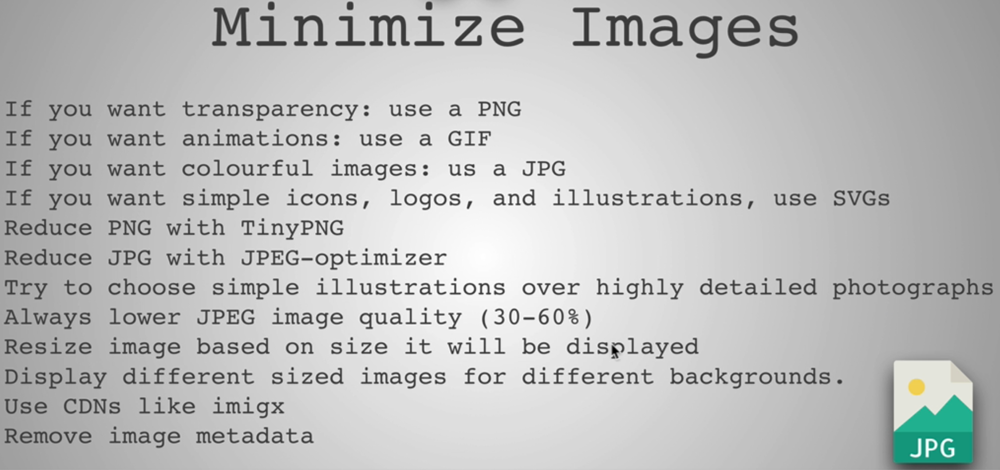

### Introduction to Performance Part 1

* Client -> Server 
* GET request for that Server's domain
* The server responds with the HTML
* The Client application upon parsing the HTML sees CSS, Img and JS
* It makes separate requests for those resources again to the Server

### 3 Keys To Performance

* Client(Frontend)
  * Critical Render Path
  * Optimized code
  * Progressive Web App
* Transfer over the wire(Network request)
  * Network latency: Time it takes from the client to the server and back to the client
  * Minimize files
  * Minimize delivery
* Server(Backend)
  * CDNs
  * Caching 
  * Load Balancing
  * DB Scaling
  * Gzip

### Network Performance

* Minimize files: Honey I shrunk the files
  * The client has to download the files from the server to view a Webpage
  * The smaller the content, the better it is
  * To do this:
    * Minimize Text: Using Uglify js or webpack
    * Minimize Images
* Minimize delivery: The Traveling deliveryman

### Image File Formats

* JPG: Complex images with lots of colors
  * Can't change the transparency
  * File Size: Big
* GIF: Color limited and is mainly used in Small Animations
* PNG: Limit the color and smaller in size compared to JPG
  * Logo
  * Add transparency
* SVG: Vector Graphics and incredibly small and can be styled with CSS
  * Can expand or compress without hampering the quality
* Resources:
  * https://99designs.com/blog/tips/image-file-types/
  * https://pageweight.imgix.com/
  * https://www.sitepoint.com/gif-png-jpg-which-one-to-use/

### Image Optimzations

* Minimizing tools
  * jpeg-optimizer
  * tiny png