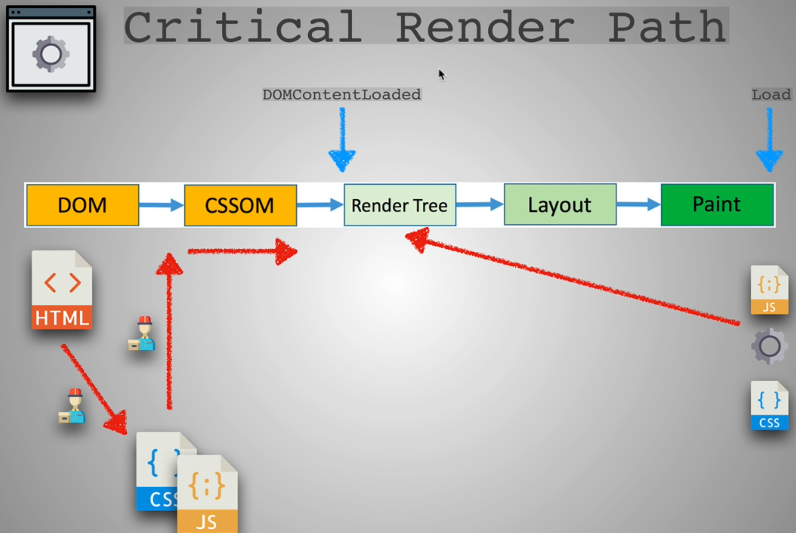
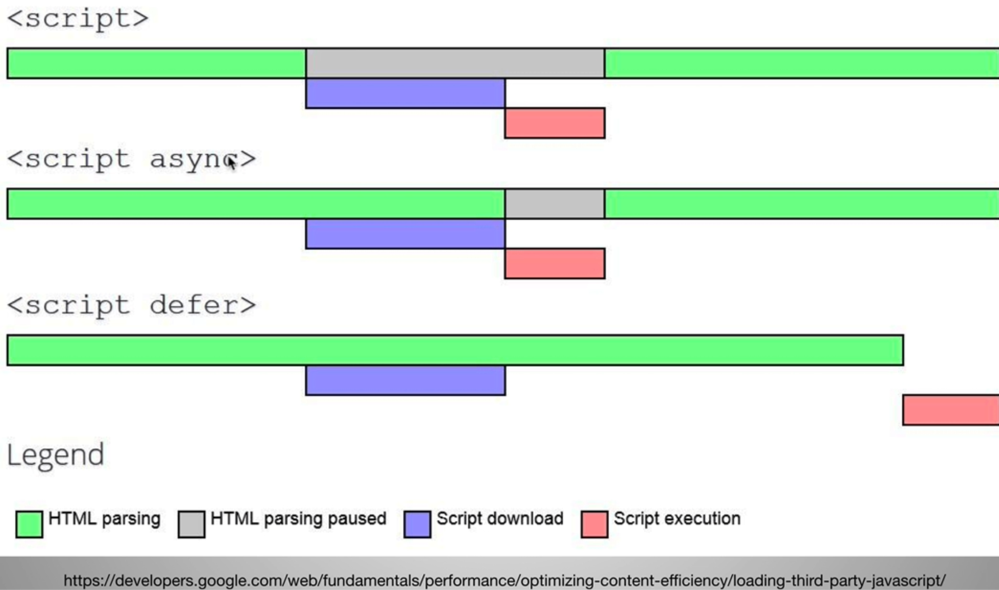
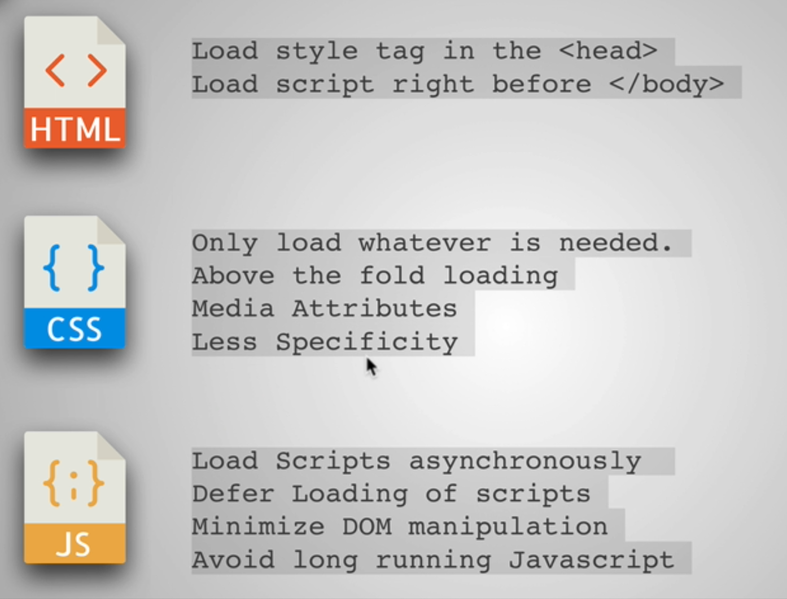

### Introduction to Performance Part 1

* Client -> Server 
* GET request for that Server's domain
* The server responds with the HTML
* The Client application upon parsing the HTML sees CSS, Img and JS
* It makes separate requests for those resources again to the Server

### 3 Keys To Performance

* Client(Frontend)
  * Critical Render Path
  * Optimized code
  * Progressive Web App
* Transfer over the wire(Network request)
  * Network latency: Time it takes from the client to the server and back to the client
  * Minimize files
  * Minimize delivery
* Server(Backend)
  * CDNs
  * Caching 
  * Load Balancing
  * DB Scaling
  * Gzip

### Network Performance

* Minimize files: Honey I shrunk the files
  * The client has to download the files from the server to view a Webpage
  * The smaller the content, the better it is
  * To do this:
    * Minimize Text: Using Uglify js or webpack
    * Minimize Images
* Minimize delivery: The Traveling deliveryman

### Image File Formats

* JPG: Complex images with lots of colors
  * Can't change the transparency
  * File Size: Big
* GIF: Color limited and is mainly used in Small Animations
* PNG: Limit the color and smaller in size compared to JPG
  * Logo
  * Add transparency
* SVG: Vector Graphics and incredibly small and can be styled with CSS
  * Can expand or compress without hampering the quality
* Resources:
  * https://99designs.com/blog/tips/image-file-types/
  * https://pageweight.imgix.com/
  * https://www.sitepoint.com/gif-png-jpg-which-one-to-use/

### Image Optimzations


* Minimizing tools
  * jpeg-optimizer
  * tiny png

### Image Optimzations 2

* Last 3 points in the above image
* Media queries for different screen sizes
* With Media queries, browser is smart enough not to download the image or resource if it's not needed for that particular Media queries screen size
* Use CDNs like imigx where they optimize and cache the images which you upload and gives an URL
* Images have metadata associated with them like where, when and from which device the image was taken
  * https://www.verexif.com/en/
  * You can remove with the above link
* Resources:
  * https://css-tricks.com/snippets/css/media-queries-for-standard-devices/
  * https://responsivedesign.is/articles/why-you-dont-need-device-specific-breakpoints/
  * https://gist.github.com/bartholomej/8415655
  * https://www.verexif.com/en/

### Delivery Optimizations

* Reducing download frequency(The Traveling Deliveryman)
* Reducing the number of Components the page requires proportionately decreases the number of HTTP requests it has to make
* Less trips
* Flexbox or CSS grids instead of Bootstrap
* Native JS methods like querySelector or querySelectorAll instead of Jquery
* So, you are thinking why not send all files at once instead of making multiple HTTP requests
  * HTTP standard has a maximum file size limit to download
  * Limit on max concurrent requests that a Browser can make
* **So to make our websites faster**
  * Minimize the files like css, js and images
  * Limit the number of files to deliver
* Max parallel http connections in a browser: https://stackoverflow.com/questions/985431/max-parallel-http-connections-in-a-browser

### Check media-queries and media-queries-exercise for Network Optimization

### Critical Render Path Introduction

* Client makes request-> Server 
* HTML
* As and when CSS, images and JS are encountered, they are downloaded
* DOM creation occurs when HTML is downloaded and is parsed by the Browser
* When CSS is downloaded, CSSOM(CSS Object Model) construction occurs
  * Styling information: How the content is styled
* When JS is downloaded, it makes the changes to DOM and CSSOM
* Render tree: Combination of DOM and CSSOM
  * The render tree captures both the content and the styles
* Browser uses Render tree to figure out the layout and paints the final Webpage

* Resource: https://developer.mozilla.org/en-US/docs/Web/Performance/Critical_rendering_path

### Critical Render Path


* The **Critical Rendering Path** is the sequence of steps the browser goes through to convert the HTML, CSS, and JavaScript into pixels on the screen
* When the HTML is downloaded, the browser parses that file
* It starts to create the DOM while simultaneously downloading other external resources when it encounters them
* Download of CSS and JS is given high priority than other resources like images
* Checkout **critical-render-path folder**

#### How to Optimize step 1 in the image
* To load **styles(CSS) as soon as possible(in \<head>)** and **scripts(JS) as late as possible(before \</body>)**
* This is because JS requires HTML and CSS parsing to finish before it can be run in Step 4
* So JS in the head tag is a big no-no
* JS blocks CSS download if it is present in the head tag before CSS links

#### CSS is render blocking, so to optimize it
* Only load whatever is needed
  * Keep the style less bloated
  * Instead of stylesheets for above the fold css, inside head tag add style block
  * Inline css
  * The above 2 will make rendering faster, because no new stylesheets are required thereby no downloads
* Above the fold loading
  * Like style2.css which we don't need for the main page for our site
  * To do this above the fold loading, we used window.onload to load the stylesheet(style2.css)
* Media attributes
  * Checkout index.html in head tag
* Less Specificity
  * Check good and bad in style3.css
  * Extra work by Browser if the specifity is complicated

#### JS, the parser blocker
* DOM construction is paused when it encounters a script tag, thereby need for download
* Also JS doesn't execute until CSSOM is constructed
* Only then JS executes
* But it can alter the DOM and CSSOM
* Only after this execution, can Render Tree be constructed
* **To Optimize**
  * Load Scripts Asynchronously

    * Download js with another thread while html is being parsed
    * But there are drawbacks 
      * When JS executes **after the page is loaded**: It affects the User experience if we are relying on JS for User experience
      * When JS executes **before the page is loaded**: Errors when it does DOM manipulation without the DOM actually being present
    * So this must done only for scripts which has nothing to do with our DOM and CSSOM(like Google analytics scripts, Tracking scripts), i.e. external scripts that require no knowledge of our code
  * Defer Loading of scripts
    * Similar to async wrt loading of our page(i.e simultaneous download of JS while html is being parsed)
    * But JS executes after our Page loads
    * Really good for scripts that act on the DOM, but also not important for loading of above the fold content
    ```txt
    When to use just scripts: Our App scripts
    When to use async: 3rd party Scripts that don't affect the DOM
    When to use defer: 3rd party Scripts which are not that important and are not above the fold
    ```
  * Minimize DOM manipulation
    * Checkout index.html of critical render path folder(mainly about script1)
    ```txt
    // Console output
    This is script 1
    DOM fully loaded and parsed
    window done!
    All resources finished loading
    ```
    * Reading the JS file, building the DOM tree, finally finished building it and finally finished loading the scripts
     ```txt
    // Console output
    This is script 1
    This is script 3
    DOM fully loaded and parsed
    This is script 2
    window done!
    All resources finished loading
    ```
  * Avoid long running Javascript
    * Page completely blocked due to JS code
    * See in index.html 
* Reference for async and defer: https://stackoverflow.com/questions/10808109/script-tag-async-defer
* Summary in below image



#### Step 8 in Critical Render Path Diagram

* Render tree is constructed after Step 4
* Layout: Positioning of the elements
* Finally painting the page
* After JS manipulates the DOM(mainly through Event Listeners), Render tree is constructed again, then the Layout and finally the Painting of the pixels
* Modern Browsers are smart enough to do a Partial redraw of the Page when JS manipulates in Step 8

### Exercise Keiko Corp Website

* Repo: https://github.com/aneagoie/keiko-corp
* Performance testing on https://aneagoie.github.io/keiko-corp/
  * Pagespeed insights
  * Webpagetest
* Exercise will be done on the Fork of the above repo(https://github.com/nuthanc/keiko-corp)

### Resources

* Checkout performance_tools.html
* https://css-tricks.com/prefetching-preloading-prebrowsing/

### HTTP/2

* Improves Network Latency
* HTTP/2 does not modify the application semantics of HTTP in any way. All the core concepts, such as HTTP methods, status codes, URIs, and header fields, remain in place. Instead, HTTP/2 **modifies how the data is formatted (framed) and transported between the client and server**, both of which manage the entire process, and hides all the complexity from our applications within the new framing layer. As a result, all existing applications can be delivered without modification.
* HTTP/2 solves the original problem — inefficient use of a single TCP connection — **since multiple requests/responses can now be transmitted over the same connection at the same time**
* require http2 in node
* Drawback: **head-of-line blocking**
  * all requests and responses are equally affected by packet loss (e.g. due to network congestion), even if the data that is lost only concerns a single request. This is because while the HTTP/2 layer can segregate different HTTP exchanges on separate streams, TCP has no knowledge of this abstraction, and all it sees is a stream of bytes with no particular meaning.
  * The role of TCP is to deliver the entire stream of bytes, in the correct order, from one endpoint to the other. When a TCP packet carrying some of those bytes is lost on the network path, it creates a gap in the stream and TCP needs to fill it by resending the affected packet when the loss is detected. While doing so, none of the successfully delivered bytes that follow the lost ones can be delivered to the application, even if they were not themselves lost and belong to a completely independent HTTP request. So they end up getting unnecessarily delayed as TCP cannot know whether the application would be able to process them without the missing bits. This problem is known as “head-of-line blocking”.
* https://developers.google.com/web/fundamentals/performance/http2/

### HTTP/3

* This is where HTTP/3 comes into play: instead of using TCP as the transport layer for the session, it uses QUIC, a new Internet transport protocol, which, among other things, introduces streams as first-class citizens at the transport layer. QUIC streams share the same QUIC connection, so no additional handshakes and slow starts are required to create new ones, but QUIC streams are delivered independently such that in most cases packet loss affecting one stream doesn't affect others. This is possible because QUIC packets are encapsulated on top of UDP datagrams.
* Using UDP allows much more flexibility compared to TCP, and enables QUIC implementations to live fully in user-space — updates to the protocol’s implementations are not tied to operating systems updates as is the case with TCP. With QUIC, HTTP-level streams can be simply mapped on top of QUIC streams to get all the benefits of HTTP/2 without the head-of-line blocking.
* As of May 2021, the HTTP/3 protocol is still officially an Internet Draft but is already supported by Google Chrome since April 2020 (including Chrome for Android, and Microsoft Edge, which is based on it).
* https://blog.cloudflare.com/http3-the-past-present-and-future/