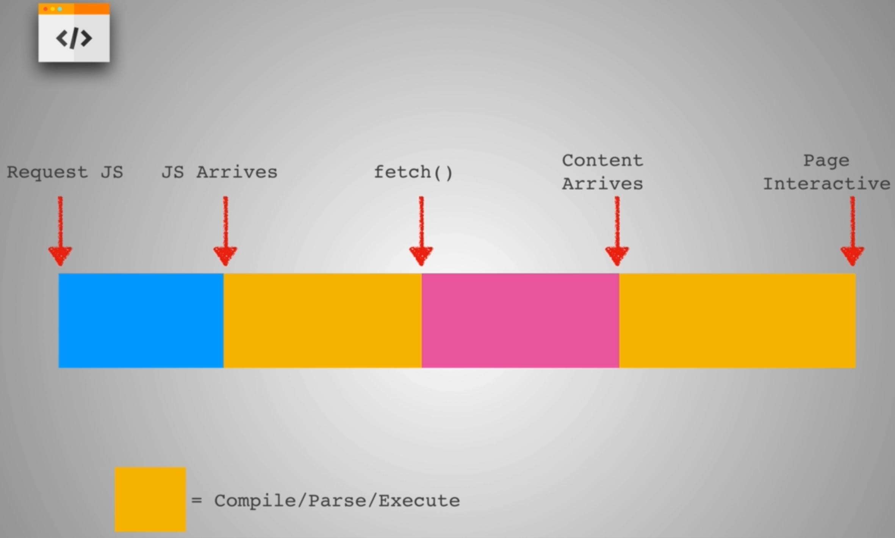
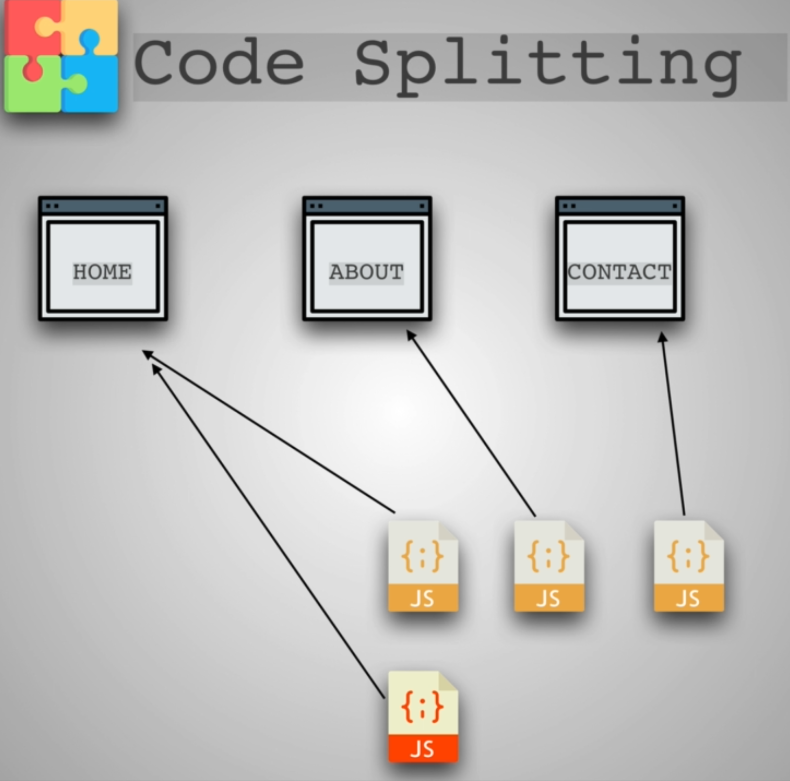
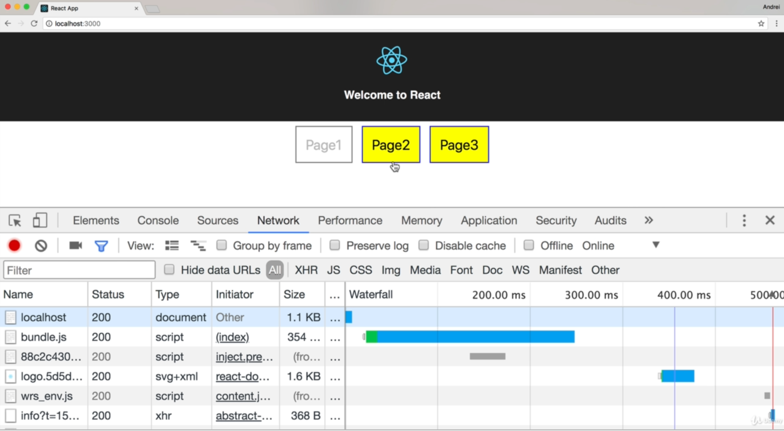
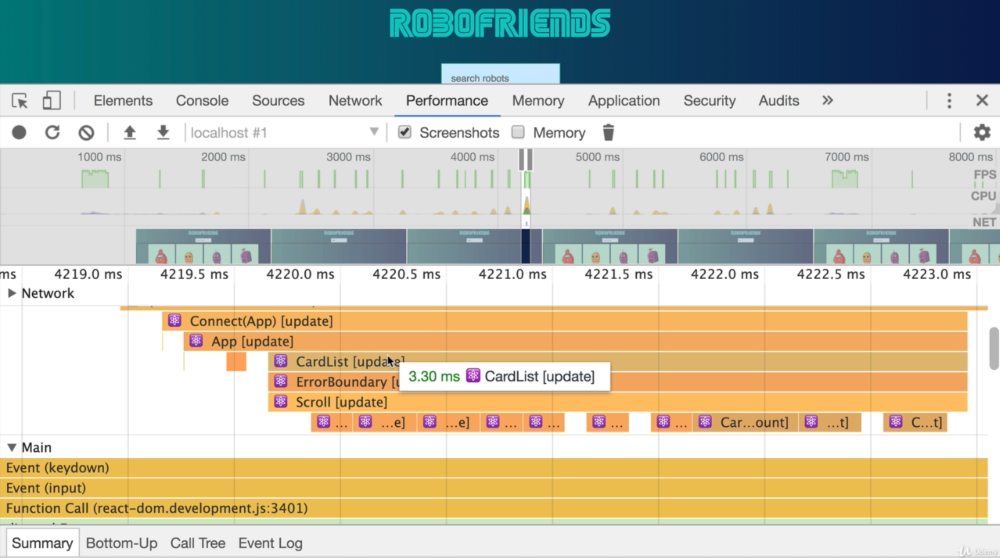
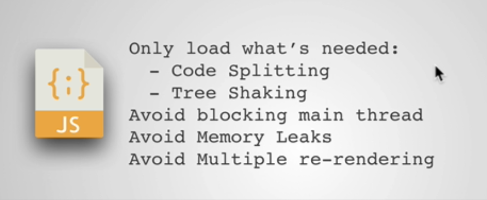

### Optimizing Code

* One of the heaviest cost is Parsing of JS code by the Browser's JS engine
* Chrome -> Inspect -> Performance -> Record -> Reload -> Stop
  * Can observe timeline to see what get's loaded at what time

* Parse, Compile and Execution of JS takes time
* Use webpagetest and check Processing Breakdown
* Browsers do JIT compilation(Just in time)
* Ahead of Compilation in Angular 2, where it the compiled code is given to the Browser, so that there is less load on the Browser
* Limit Animations 

### Code Splitting Introduction

* Send minimally functioning page composed of HTML, CSS and JS needed for the current route or page and as more resources arrive, the App can lazy load
* Instead of one big massive JS file containing all the code from combining multiple small JS files, load JS only when it is required
* Lazy Loading: Loading other resources after our Page becomes interactive
* Load only the bare minimum required and then download the other resources in the Background

* Red is the vendor file like React which is required in every Page
* Production build: npm run build
  * Minimized and Optimized code

### Code Splitting Part 1

* Use create-react-app to build an App
* **Repo link**: https://github.com/nuthanc/code-splitting-exercise
* App with 3 Pages as children but only one is displayed based on logic or route


### Code Splitting Part 2

* Dynamic imports
  * Imports not at the top of the file, but when required
  * Works only because of webpack
* Check above mentioned Repo's App.js Part 2 comments
```js
this.state = {
  route: 'page1',
  // Part 2 - Code Splitting - manual
  component: null
}

import('./Components/Page2')
  .then((Page2) => {
    // console.log(Page2); This show Page2 Component is under default property
    this.setState({ route: route, component: Page2.default })
  })
  .catch(err => {
  });

// Part 2 - No Code Splitting - manual
if (this.state.route === 'page1') {
  return <Page1 onRouteChange={this.onRouteChange} />
} else {
  return <this.state.component onRouteChange={this.onRouteChange} />
}
```
* Check this in Chrome Network tab, refresh and Clear all and click on Page2 or Page3
  * You see 1.chunk.js or *.chunk.js
* Page2 and Page3 are not part of bundle.js downloaded initially

### Code Splitting Part 3

* Cleaner way instead of this.state.component is AsyncComponent
* Check App.js and AsyncComponent of code-splitting-exercise repo
* AsyncComponent is a higher order Component(i.e, a Component which returns other Component)
```js
// Below example for Assigning to new variable
const o = {p: 42, q: true};
const {p: foo, q: bar} = o;

console.log(foo); // 42
console.log(bar); // true

if (this.state.route === 'page1') {
  return <Page1 onRouteChange={this.onRouteChange} />
} else if (this.state.route === 'page2') {
  const AsyncPage2 = AsyncComponent(() => import("./Components/Page2"));
  return <AsyncPage2 onRouteChange={this.onRouteChange} />
} else {
  const AsyncPage3 = AsyncComponent(() => import("./Components/Page3"));
  return <AsyncPage3 onRouteChange={this.onRouteChange} />
}
```
* Now AsyncComponent can be used for dynamic imports and rendering the Component based on the function passed as argument
* npm run build has a bigger main.js because of import of AsyncComponent
  * Analyze the trade-offs
  * The Pages are asyncronously loaded when required

### Code Splitting Part 4

* Route based(Pages) Splitting
  * Splitting based on Route like Home page, About page etc
* There is also Component based Code Splitting
* Also checkout **React Loadable** and also **docs in React for Route-based Code Splitting**
* Code Splitting with React.lazy Repo: https://github.com/nuthanc/code-splitting-exercise-updated
  * Check Part 4 changes in the Repo
  * Wrap Lazy Components with Suspense Component which does something(fallback) while the Component loads(download and fetched)

### React Performance Optimizations

* localhost:3000/?react_perf
  * Open Developer Tools -> Performance -> Record -> Search something in Robofriends App -> Stop
  * Checkout the CPU graph
  
  * You see that if the Nesting is deep, then the Re-render of the child components all down to the Leaf Children will happen
  * By using Redux, we can be smart about what Components Update
* React Developer tools Chrome Plugin
  * Developer tools -> React tab
  * Highlight Updates
  * This shows what is being Rerendered when changes are made
  * Using this, we can see what is being Rerendered unnecessarily

### React Performance Optimizations 2

* Andrei's Robofriends Repo: https://github.com/aneagoie/robofriends/blob/master/src/containers/App.js
* We saw that Header <h1> was getting Rerendered unnecessarily
* So he separated that to a separate Header component and used shouldComponentUpdate Lifecycle method
  * When true is returned from shouldComponentUpdate, it will update the Component and vice-versa
```js
import React, { Component } from 'react';

class Header extends Component {
  shouldComponentUpdate(nextProps, nextState) {
    return false;
  }

  render() {
    console.log('Header');
    return <h1 className='f1'>RoboFriends</h1>
  }
}

export default Header;
```
* The above was not a good Example where the Component never updates when the state changes
* Let's take another Example
```js
import React, { Component } from 'react';

class CounterButton extends Component {
  constructor() {
    super();
    this.state = {
      count: 0;
    }
  }

  shouldComponentUpdate(nextProps, nextState) {
    if (this.state.count !== nextState.count) {
      return true;
    }
    return false;
  }

  updateCount = () => {
    this.setState({count: this.state.count + 1});
  }

  render() {
    console.log('CounterButton');
    return <button color={this.props.color} onClick={this.updateCount}>Count: {this.state.count}</button>
  }
}

export default CounterButton;

// <CounterButton color='red' />
// The above is called from Header Component
```
* Sometimes sideeffect occurs when we use currentState to update
  * State updates are not synchronous
```js
// Recommended way
this.setState(state => {
  return { count: state.count + 1}
})
```
* By adding condition in shouldComponentUpdate, the CounterButton rerenders only when counter changes
* This is a good thing because whenever Header(Parent) rerenders, CounterButton rerenders conditionally upon counter change
* There is a nice class in React called **PureComponent** which when extended adds shouldComponentUpdate by default and returns true(condition for rerendering) only when the Props change
  * One downside is it does shallow comparison and doesn't work as expected for Complex data structures(Deeply nested objects)
* Awesome tool for this is **Why did you update** or **Why Did You Render**
  * https://www.npmjs.com/package/why-did-you-update(Deprecated)
  * https://www.npmjs.com/package/@welldone-software/why-did-you-render

### Optimizing Code Review


* Tree shaking
  * Big library, but using only one or two functions from that
  * Then webpack will only import the required functions instead of the whole library 
* Avoid memory leaks
  * Clean up variables and Event listeners when they are not used
* Tree shaking resource: https://developers.google.com/web/fundamentals/performance/optimizing-javascript/tree-shaking/

### Progressive Web Apps

* Web Apps that behave like Native Apps(Mobile) with Offline content, no URL, Install capabilities, Hardware access, Interactive, Responsive etc
* PWA capability is already set in create-react-app
* Install Chrome extension called **Lighthouse** to see what can be improved in our site for PWA
* Author's Robofriends link: https://github.com/aneagoie/robofriends-redux
* 3 main things
  * HTTPS
  * App Manifest
  * Service Worker

### PWA - HTTPS

* HTTPS: Requests and Responses are Encrypted, so that it is Secure
* Robofriends App passes this as Github pages automatically gives us a https link
* **Let's Encrypt** is a free service for certification(Implementing HTTPS yourself)
* **Cloudfare** for hosting sites
* Github Pages: https://pages.github.com/
* Progressive Web Apps Checklist: https://developers.google.com/web/progressive-web-apps/checklist

### PWA - App Manifest

* In index.html, meta tag for viewport is **necessary**
  * This is for optimizing the view in multiple devices
* Also, a manifest file is required
  * This is given out of the box from create-react-app in public/manifest.json
  * This manifest gives the Icon(because Icon image is referenced here) when the App is downloaded
* We can use realfavicongenerator to generate icons(images) in various sizes(for different devices)
* Splash Screen is when the Web App is loading instead of white screen you provide background or image or whatever from the manifest.json