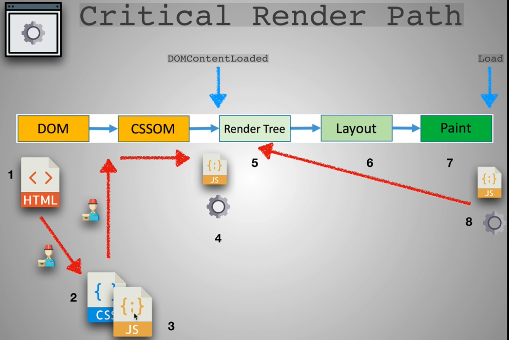

### Critical Render Path Review

* React helping with changes in DOM manipulation and creaation of Render tree in Step 8
* Webpack with JS delivery in Optimizing Step 3
* Redux also helping React in Step 8

### State Management

* React: this.state
* Remember state as Memory
* State describes how our App should look
* In an App with large number of Components, keeping track of state is really hard
* State management with Redux
  * State in a store
  * One massive object holding the state

### Why Use Redux

* Good for managing large state
* Useful for sharing data between containers
* Predictable state management using the 3 principles
  * Single source of truth
  * State is read only
  * Changes using pure functions
* Action -> Reducer -> Store -> Make changes
* Actions: What a User does like clicking of button
* Reducer: A pure function which receives an input and returns state
* Redux uses Flux pattern
  * Action -> Dispatcher -> Store -> View
  * In this, even though multiple Actions come through, they go through a Pure function keeping it Predictive and Simple
* MVC pattern
  * Action -> Controller -> Model -> View
  * With change in Model, the View changes which in turn changes the Model which in turn changes the View
  * So there is a cycle of events between Model and View
