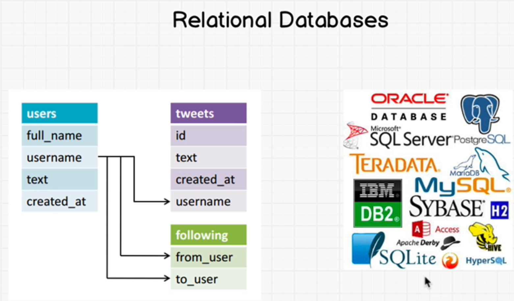
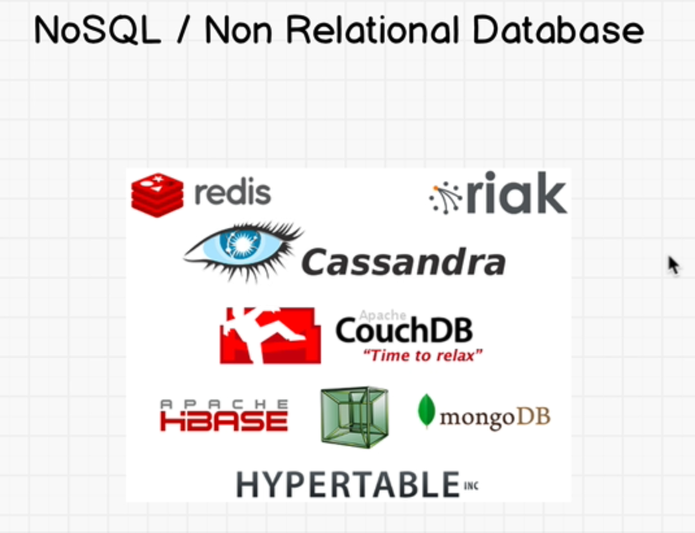
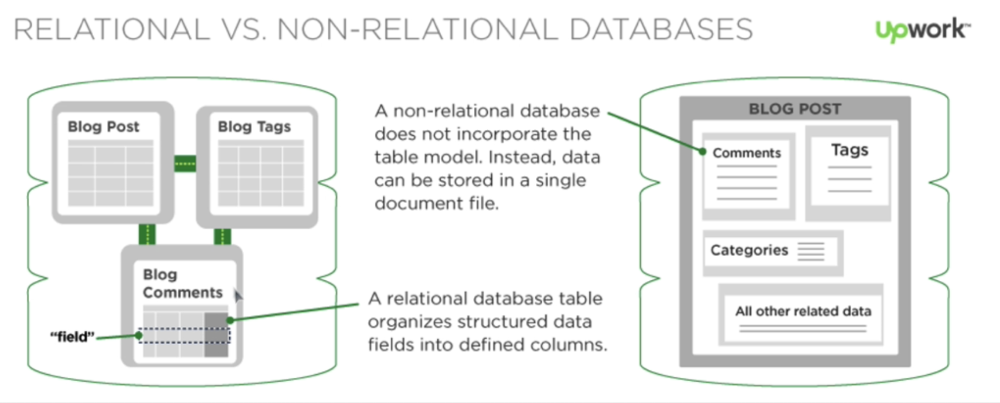

### Bruno's Request

* User stays signed in upon Page Refresh

### Section Overview

* Redis: NoSQL database in-memory db 
* Classificatoin of NoSQL Databases:
  * Redis: Key-Value(High performance scalable web applications like sessions)
    * In Memory db so it's much faster
    * Does take snapshots to disk every once in a while(Unexpected shutdowns)
  * MongoDB and CouchDB: Document(Like LinkedIn profile containing a variety of fields)
  * Cassandra: Wide Column
  * neo4j: Graph(Social media)

### Introduction to Databases

* Database: Collection of data
* DBMS: Tools that give access to data and work with data

* Relational databases use SQL
  * users.txt
  * tweets.txt
  * profile.txt
  * following.txt

* Non-Relational doesn't require schema first(Unstructured data)
* MongoDB as an example
  * user1.txt
  * user2.txt
  * user3.txt


### Installing Redis

```sh
make 
src/redis-server
src/redis-cli
```
* If Redis installation fails: https://stackoverflow.com/questions/37103054/redis-installation-fails-with-newer-version-of-jemalloc-required-when-running
* https://stackoverflow.com/questions/8131008/issue-with-redis-install-cc-command-not-found

### Redis Commands

```txt
SET name "Godzilla"
GET name
EXISTS name
DEL name
SET session "Jenny"
# Expire after 10 seconds
EXPIRE session 10 
GET session
```
* Full list of commands: https://redis.io/commands

### Redis Data Types

```sh
MSET a 2 b 5
GET a
GET b
MGET a b
# All these return Strings
```

### Redis Hashes

```sh
HMSET user id 46 name "Johnny"
HGET user id
HGET user name
HGETALL user
```
* Like objects

### Redis Lists

```sh
# Left Push
LPUSH ourlist 10
# Right Push
RPUSH ourlist "hello"
LRANGE ourlist 0 1
# "10" and "hello"
LPUSH ourlist 55
RPOP ourlist
LRANGE ourlist 0 1
# "55" and "10"

```
* Implemented with Linked lists

### Redis Sets + Sorted Sets

```sh
SADD ourset 1 2 3 4 5
# 1 2 3 4 5
SMEMBERS ourset
SADD ourset 1 2 3 4
SMEMBERS ourset 
# 1 2 3 4 5
SISMEMBER ourset 5
# (integer) 1
SISMEMBER ourset 25
# (integer) 0

# Sorted set
ZADD team 50 "Wizards"
ZADD team 40 "Cava"
ZRANGE team 0 1
# Cava Wizards
ZADD team 1 "Bolts"
ZRANGE team 0 2
# Bolts Cava Wizards
ZRANK team "Wizards"
```