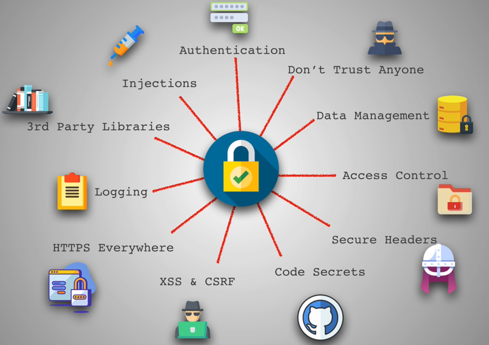

### Star of Security



### Injections

* Most common Attack
* Injecting code to another piece of code
* Most famous: SQL Injection
* https://www.hacksplaining.com/exercises/sql-injection
```txt
' or 1=1--
The above in Password field so that it will return True
'; DROP TABLE users; --
```
```sql
CREATE TABLE sqlinjection (
  id serial PRIMARY KEY,
  email text UNIQUE NOT NULL
)

INSERT INTO sqlinjection (email) VALUES ('lol');

--Example of sql injection
INSERT INTO sqlinjection (email) VALUES (''; DROP TABLE sqlinjection; --);

-- means comment everything after it
```
* https://github1s.com/aneagoie/security-client-exercise/blob/HEAD/index.html
* https://github1s.com/aneagoie/security-server-exercise/blob/HEAD/server.js
```js
<script>alert('boom')</script>
```
* Scripts injected into the DOM via script tags in innerHTML are not run at the time they are injected
  * Inline scripts are run at the time the original page is parsed
```js

```
* On the other hand, images injected into the DOM are loaded at that time, and if the loading fails, then the onerror event handler is called 
* But Images are loaded
* https://github1s.com/aneagoie/security-client-exercise/blob/HEAD/script.js#L2
* Use **createTextNode instead of innerHTML**

#### 3 ways to prevent Injection
1. Sanitize input: For data validation, only allow user to enter data of expected type(like text, email etc)
2. Parametrize Queries: Give only parameters 
3. Knex.js or other ORMS

### 3rd Party Libraries

* Library you can trust
* Go to Github and check their stars and forks
```sh
npm install -g nsp
# use sudo if you lack permission
nsp check # audit package.json

npm install -g snyk
synk test # audit node_modules directory
```

### Logging

* With good Logging, we would be able to find issues quickly
```sh
npm i winston
npm i morgan
```
```js
const morgan = require('morgan')

app.use(morgan('combined')); // or 'tiny'
```
* http://expressjs.com/en/resources/middleware/morgan.html
* https://github1s.com/aneagoie/security-server-exercise/blob/HEAD/server.js#L18-L19
* https://www.npmjs.com/package/winston
* Never log out system errors to Front-end