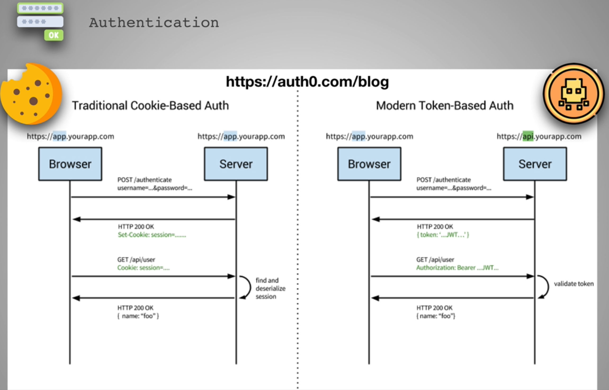

### Section Overview

* JWT: Json Web Tokens
* Users authenticate and receive token from the server to access whatever they have rights to and make changes

### Cookies vs Tokens

* **Cookie Based Auth is stateful**
  * Both the Browser and Server needs to have details about the Cookie
  * Once the User logs out, the session is destroyed both on the Server and Client side
* In JWT, instead of Cookie a Token is sent back
* The browser later makes requests with the token in Authorization Header field instead of Cookie
* The Server doesn't have to store the token, just running verify method is sufficient
* **Token Based Auth is stateless**
  * The Server doesn't have to keep record, just decoding and verifying the token
  * Same JWT token can be used over multiple APIs
  * JWT can contain useful info as well unlike Cookies which contain random strings
  * JWTs can be used with other platforms
  * Size of token can become *problematic*
* Resources:
  * https://dzone.com/articles/cookies-vs-tokens-the-definitive-guide
  * https://scotch.io/bar-talk/why-jwts-suck-as-session-tokens
  * https://stackoverflow.com/questions/17000835/token-authentication-vs-cookies

### What We Are Building

* Client sends Username and Password to authenticate with the Server
* The Server validates the Username and Password and generates the JWT and also stores it in Redis
* Any further requests from the Client includes the JWT
* The Server will check for the Token within the Redis DB and then responds if it has the token in Redis