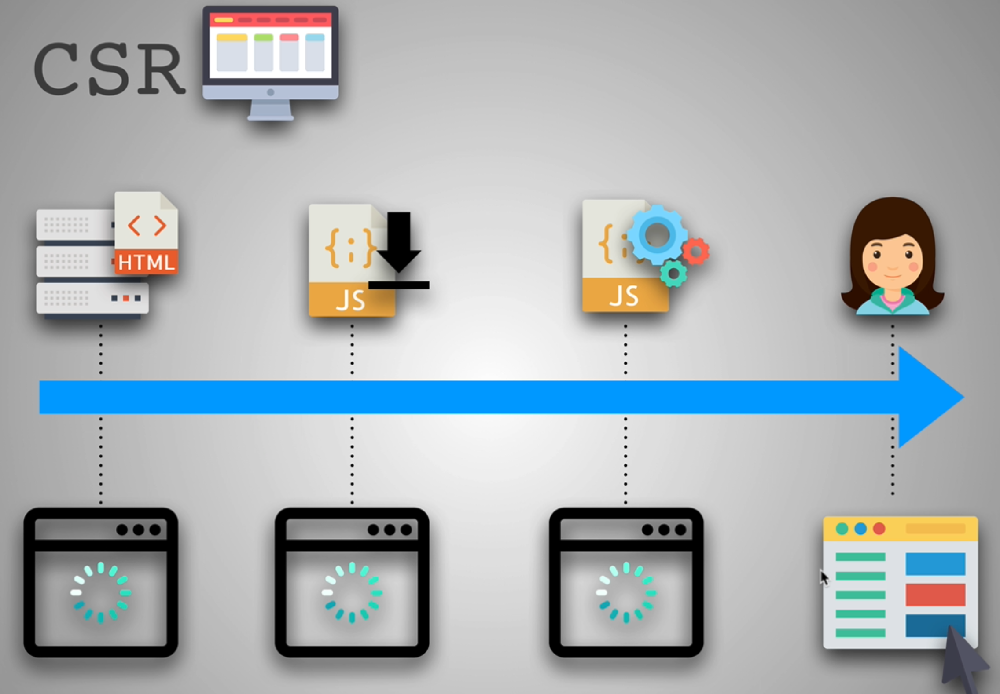
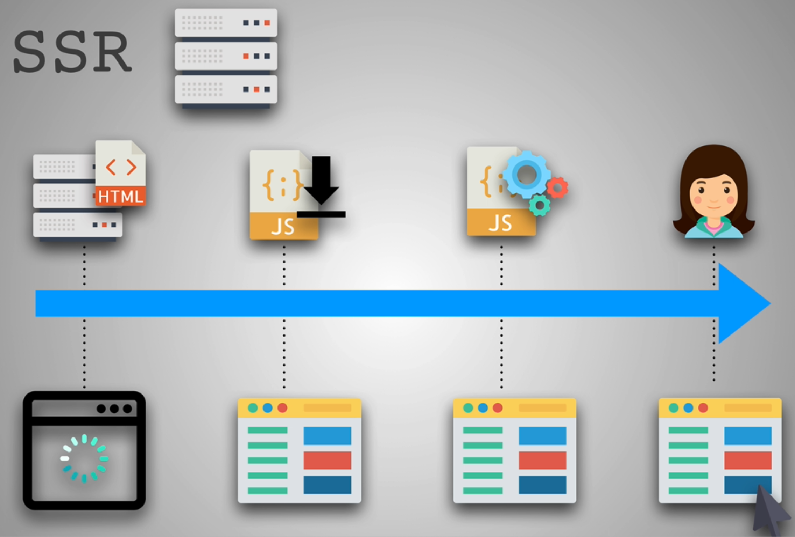
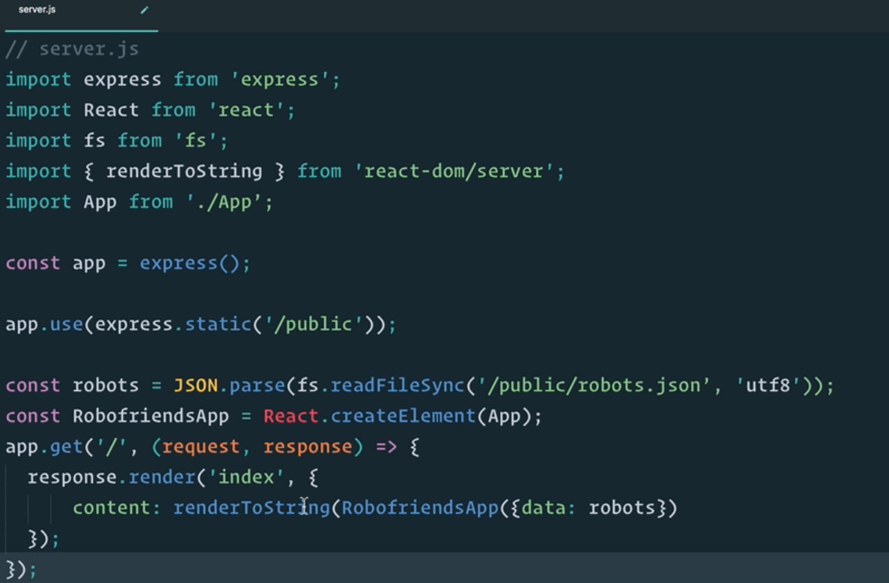

### Section Overview 

* Client Side rendering: SPA(Single Page Applications)
  * Single HTML in which JS takes care of Routing, DOM manipulation etc
  * When you click on a link, instead of new HTML, parts of the HTML gets rerendered using JS
  * Bloated because of more JS
  * Slower SEO
* Server Side rendering:
  * Server serves a new HTML for every new Page
  * Browser rerender everything on the Page

### CSR vs SSR



* CSR: **Minimum barebones HTML** and when JS is encountered, it requests it from server and then it gets Parsed
  * Times when it shows loading
  * But after it is loaded and executed, links to other Pages, doesn't have to request further resources
  * Only parts of the web page gets rerendered



* SSR: Renders a lot faster on the initial request because the server responds with a **fully rendered Page**

### Server Side Rendering React


* HTML to React syntax using React.createElement
* response.render: Render index with content

* In SSR, the HTML is fully rendered, so the Browser saves time on Mounting
* You need to send string or json over the wire from server to client
* In general, with any library, on the Server the client App needs to be rendered to String and finally on the client side, you need to attach only event listeners as the html is already parsed
* With React library,
  * On Server -> ReactDOM.renderToString() or ReactDOM.renderToNodeStream()
  * On Client -> ReactDOM.hydrate()

### CSR vs SSR Part 2

* CSR
  * Pros
    * Rich Interactions
    * Faster Response
    * Web Applications
  * Cons
    * Low SEO potential
      * Crawlers such as Google bot only see the div of App and thinks there is not much content
      * Doesn't see the AJAX request made
      * Crawlers wait only 10-15 seconds to take the snapshot of the Webpage
    * Longer initial load
* SST
  * Pros
    * Static Sites(Like React docs where the content is static(text based info) and the html changes at the top as new links are clicked)
    * SEO
    * Initial Page Load
  * Cons
    * Full Page Reloads
    * Slower Page rendering
      * Server needs to render the App on the server using synchronous CPU dom call(renderToString) which holds off the event loop, so any other request cannot be processed
    * Requests to server

### SSR React Libraries

* Gatsby and Next

### Setting Up Next.js

```sh
mkdir next-ssr
npm init -y
npm i next react react-dom
mkdir pages
```
* start script to **next** in package.json 
* Add index.js for some content
* **View Page Source** shows the whole content versus only div id of root in React robofriends App

### Next.js Pages

* Link to add client side routing behavior in Next.js

### Client Side Routing

* Routing doesn't require request to Server
* JS on the client side takes care of it
* In next.js, using Link adds the behavior of client side rendering, i.e refreshing only parts of the Page without reloading the entire Page
* Client vs Server side Routing: https://medium.com/@wilbo/server-side-vs-client-side-routing-71d710e9227f

### Shared Components

* components folder in root dir of next App
* It can also be in pages, but it is usually in root of the App folder
* Add Component class in components folder and import that in about.js of pages dir