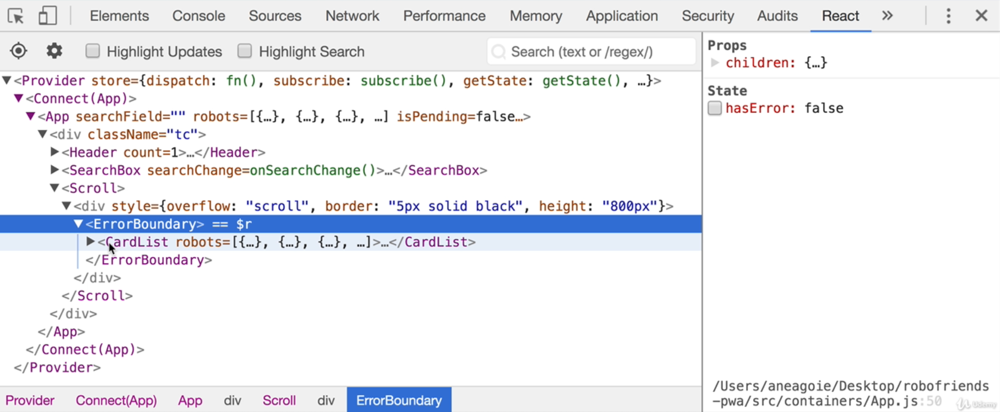

### Testing Overview

* Repo: https://github.com/aneagoie/robofriends-testing
* As the Application grows, it becomes difficult to test manually all the features
* Also the code which you add may unintentionally impact other part of the code
* Without tests, these doesn't get caught immediately

### Types of Tests

* Unit Tests
  * Tests individual functions or classes
  * Easiest to implement
* Integratoin Tests
  * Testing how different pieces of code work together
  * Ex, db works with express app, how a function works with another function
* Automation Tests
  * UI test, tests on the browser about the expected behavior

### Testing Libraries

* Top 3 Testing libraries: Jasmine, Jest and Mocha
  * Provides the skaffolding like methods and classes
* Assertion libraries: Jasmine, Jest and Chai(Paired with Mocha)
  * Comparison between Actual and Expected values
* Test Runner: Jasmin, Jest, Mocha and Karma.js(In browser)
  * Something that allows us to run tests
  * Puppeteer by Google is a stripped down version of Browser 
  * jsdom: dom like api
  * npm run test with react does **react-scripts test --env=jsdom**
* Mock, Spies and Stubs: Jasmine, Jest and Sinon.js(Paired with Mocha)
  * Spies provide info about functions like how many times it was called, in what cases and by who
    * https://sinonjs.org/releases/v11.1.1/spies/
  * Stubbing replaces selected functions with functions to check whether the expected behavior happens
    * https://sinonjs.org/releases/v11.1.1/stubs/
  * Mocks is faking a function or behavior to test different parts of a process
    * https://sinonjs.org/releases/v11.1.1/mocks/
  * A backend server can be faked with Sinon stub
* Code coverage: Istanbul, Jest(Underneath uses Istanbul)
  * What percent of code are covered by tests
  * npm test -- --coverage

### Unit Tests

* Individual small units
* Based on an input, get an output
* Unit tests are extremely useful for Pure functions
* React functional components with no state are Pure functions
* Pure functions: Functions with no side effects, i.e they are deterministic

### Integration Tests

* Cross communication between different units of code
* Spies and Stubs are used to mock integration with other components
* Brittle and harder to write

### Automation Tests

* UI tests run on browser or browser-like env
* Simulate User behavior
* Ex: Checkout flow
* Hardest to setup
* End to End Test
* Nightwatch, webdriveio, TestCafe, Nightmare, Cypress are some of the services that provide Automation Testing
* UI tests take longer time

### Final Note on Testing


### Setting Up Jest

* https://jestjs.io/docs/getting-started
```sh
mkdir test && cd test
npm init -y
touch script.js
npm install --save-dev jest
```
* Update test script in package.json
```sh
npm test

> test@1.0.0 test /Users/nuthanc/personal_projects/junior_to_senior/testing/test
> jest

No tests found, exiting with code 1
Run with `--passWithNoTests` to exit with code 0
In /Users/nuthanc/personal_projects/junior_to_senior/testing/test
  3 files checked.
  testMatch: **/__tests__/**/*.[jt]s?(x), **/?(*.)+(spec|test).[tj]s?(x) - 0 matches
  testPathIgnorePatterns: /node_modules/ - 3 matches
  testRegex:  - 0 matches
Pattern:  - 0 matches
```
* So add script.test.js

### Our First Tests

*  --watch *.js in jest command to watch changes for js files
* We mock the db in the tests because it is an expensive operation to import or get hold of db
* Also we want Pure function for googleSearch so that db can be passed as an argument

### Writing Tests

* It's better to have more tests because it is never going into Production and you can cover a lot of scenarios
* Don't worry of repeating in Tests
* Make tests fail first before you make them pass
* Group tests with **describe**

### Asynchronous Tests

* Stars Wars API: https://swapi.dev/
* Jest cheat sheet: https://github.com/sapegin/jest-cheat-sheet
* Fetch is not available on node, we need to install it via npm i node-fetch
* Checkout script2.js and script2.test.js
* expect.assertions call to expect the number of assertions in the test
* Need **done** argument, which needs to be called after the async request, otherwise test passes and exits without even asserting
* Other than **done**, we can also use **return** to wait for the promise to return

### Mocks and Spies

* Mock the fetch function

### Testing Exercise Repos

* https://github.com/aneagoie/udemy-testing-exercise
* https://github.com/aneagoie/robofriends-pwa

### Introduction to Enzyme

* https://enzymejs.github.io/enzyme/docs/api/
* https://github.com/aneagoie/robofriends-testing
* Enzyme for Component Testing to see whether the div get rendered, h2 get rendered etc
```sh
npm i --save-dev enzyme enzyme-adapter-react-16
```
* setupTests.js required as part of Setup: https://github.com/aneagoie/robofriends-testing/blob/master/src/setupTests.js
* shallow(Using this 90% of the time), mount and render functions from enzyme
* In Card.test.js, console.log(shallow(<Card />)) and check
  * You see **ShallowWrapper { length: 1 } as output
  * shallow does Shallow rendering, i.e. it renders only Card component only even thought if it has other Child components
  * This allows to test one Component at a time
* react-scripts already has jest, so we can run npm test
```js
expect(shallow(<Card />).length).toEqual(1);
```
* mount does a full DOM rendering
  * Life cycle method
  * DOM API like querySelectorAll
  * Headless browser or JSDOM is recommended
* render is used for rendering React Components, but unlike to a real DOM, it's rendered to a static HTML
  * In between shallow and mount
  * It doesn't require a DOM API like mount
  * It renders Child components too

### Snapshot Testing

* Snapshot Testing involves taking a Snapshot of the Component and later checking whether it matches the Snapshot
* https://github.com/aneagoie/robofriends-testing/blob/master/src/components/Card.test.js
* When we use **toMatchSnapshot()**, it creates a folder called __snapshots__ with the name of the test file
* When changes are made to the Component, the test fails showing the diff
* If there are intentional changes, press w and press u to update failing snapshots(Take another snapshot)
* To check code coverage, **npm test -- --coverage**

### Snapshot Testing + Code Coverage

* https://github.com/aneagoie/robofriends-testing/blob/master/src/components/CardList.test.js

### Testing Stateful Components

* How to test whether the **count state of Counter component** is incrementing or not?
* https://github.com/aneagoie/robofriends-testing/blob/master/src/components/CounterButton.test.js
* Even for Stateful Components, we can still do toMatchSnapshot() tests
* We can find elements within a Component using *find* method and can also simulate actions such as clicking of button, keypress etc
* We can also check for props
```js
expect(wrapper.props().color).toEqual('red')
```

### Testing Connected Components

* How to test connected components(redux) like App.js(https://github.com/aneagoie/robofriends-testing/blob/master/src/containers/App.js)
```js
import React from 'react';
import { shallow } from 'enzyme';
import App from './App';

it('expect to render App Component', () => {
  // Part 2
  const mockStore = {
    robots: [],
    searchField: ''
  }
  expect(shallow(<App store={mockStore}/>)).toMatchSnapshot();
  // Even after mocking store, we get an error state.getState is not a function
  // End of Part 2

  // Part 1
  expect(shallow(<App />)).toMatchSnapshot();
  // Could not find "store" in either context or props of Connect(App)...
});
```
* We can use redux-store-mock library, but let's simplify our Component
* You can check how the App structure looks by opening React section in Developer tools for Robofriends site

* Moved the rendering jsx to MainPage.js(https://github1s.com/aneagoie/robofriends-testing/blob/HEAD/src/components/MainPage.js) so that App can mainly concentrate on Connecting to redux store
* Now, we don't even have to test App.js because it has only redux store stuff(state and dispatch), and it is already tested in redux(Testing Functionality of Redux)
* So testing only MainPage.js is sufficient
* Make your tests easy
  * If it's not easy to write tests, then the Component is complicated, so try to make it simplified just as we split it here in case of App and MainPage.js
* https://github1s.com/aneagoie/robofriends-testing/blob/HEAD/src/components/MainPage.test.js
* Moved filterRobots from render to a separate function to test this easily
* **instance()** method gives access to all the Instance methods of the class

### Testing Reducers

* https://github1s.com/aneagoie/robofriends-testing/blob/HEAD/src/reducers.test.js
* Easier to test as they are Pure functions